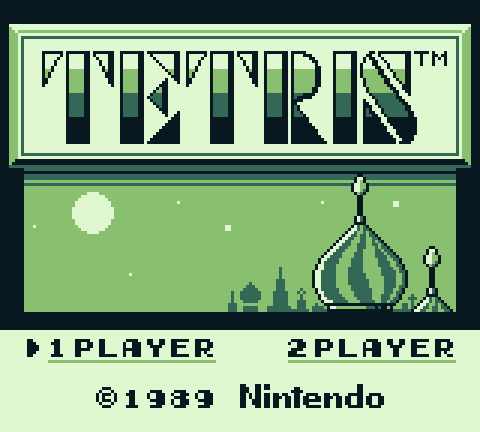

# rustboy

A Game Boy (DMG) emulator written in Rust.

<p align="center">
  
</p>

CPU, timer, interrupts, PPU (background / window / sprites), joypad, and the
no-MBC / MBC1 / MBC3 / MBC5 cartridge mappers are implemented. No sound (APU),
no save files, no link cable, and PPU timing is scanline-accurate rather than
dot-accurate.

## Requirements

- **Rust 1.85 or newer** (the crate uses edition 2024). Developed on 1.98.
  Install via [rustup](https://rustup.rs):

  ```bash
  curl --proto '=https' --tlsv1.2 -sSf https://sh.rustup.rs | sh
  ```

- **Linux only:** the window backend (`minifb`) needs X11/Wayland dev packages,
  e.g. on Debian/Ubuntu:

  ```bash
  sudo apt install libxkbcommon-dev libwayland-dev libxcb-shape0-dev libxcb-xfixes0-dev
  ```

  macOS and Windows need nothing extra.

## Build & run

```bash
# Windowed emulator (opens a 4x-scaled window)
cargo run --release -- "path/to/game.gb"

# With no argument it runs the bundled blargg cpu_instrs ROM
cargo run --release

# Headless: run a blargg-style test ROM, stream its serial output, exit
# 0 = Passed, 1 = Failed, 2 = crashed / no verdict
cargo run --release -- --headless "test-roms/blargg/cpu_instrs/cpu_instrs.gb"

# Dump one frame to a PGM image (headless, for debugging the PPU)
cargo run --release --example dump_frame -- "path/to/game.gb" 600 frame.pgm
```

A ROM path is resolved as given, then relative to the crate root.

### Controls

| Key | Button |
|-----|--------|
| Arrow keys | D-pad |
| `Z` | A |
| `X` | B |
| `Enter` | Start |
| `Backspace` / `Right Shift` | Select |
| `Esc` | Quit |

## Tests

```bash
cargo test                       # everything
cargo test --test blargg         # just the ROM suite (one #[test] per ROM)
cargo test --test blargg -- --nocapture        # show serial output
cargo test --test blargg -- --test-threads=1   # one ROM at a time
```

The ROMs the suite needs are committed under [`test-roms/`](test-roms/), so a
fresh clone runs `cargo test` with no setup. `[profile.test] opt-level = 3`
keeps the run to a few seconds despite the ROMs executing tens of millions of
instructions.

## Tested ROMs

### Automated — `cargo test`

blargg's `cpu_instrs` suite (committed in `test-roms/blargg/`):

| ROM | Result |
|-----|--------|
| `01-special` … `11-op a,(hl)` (11 individual sub-tests) | **Pass** |
| `cpu_instrs.gb` (combined, MBC1, exercises bank switching) | **Pass** |

### Manual — commercial games

Checked to boot and render correctly (dumps not committed — copyright):

| Game | Mapper | Status |
|------|--------|--------|
| Tetris (v1.1) | none (32 KiB) | Boots to the title screen; menu navigable |
| Dr. Mario | MBC1 | Boots to the title screen |
| Pokémon Blue | MBC3 (+ frozen RTC) | Boots through the intro animation |

## Project layout

| Path | What |
|------|------|
| `src/cpu/` | SM83 CPU core, opcode tables |
| `src/memory.rs` | MMU — region dispatch, OAM DMA, wires joypad |
| `src/cartridge.rs` | Header parsing + no-MBC / MBC1 / MBC3 / MBC5 |
| `src/ppu.rs` | LCD timing state machine + scanline renderer |
| `src/joypad.rs` | 0xFF00 button matrix |
| `src/timer.rs` | DIV / TIMA / TMA / TAC |
| `src/lib.rs` | `GameBoy` (ties it together), `run_test_rom` |
| `src/main.rs` | Windowed frontend + `--headless` test runner |
| `tests/` | `blargg.rs` (ROM suite), `ppu.rs` (render smoke tests) |
| `test-roms/` | Committed blargg ROMs (see its README) |
| `roms/` | **git-ignored** — your local ROM library / boot ROM |
